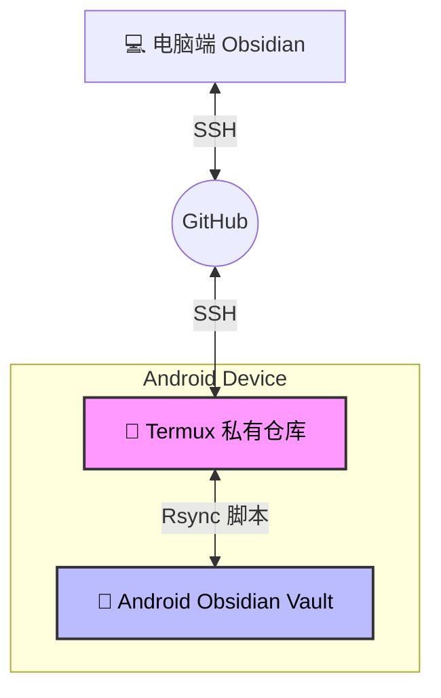

# 📘 Obsidian 多端同步终极方案 (Android + PC + Git)

> **彻底解决 Android 端的 Git 权限问题、仓库损坏问题以及多端插件配置冲突。**

[](LICENSE)


## 🧐 痛点与背景

在 Android 设备上直接对 Obsidian Vault 使用 Git 同步经常会遇到以下“地狱级”问题：

1.  ❌ **权限地狱**：Android 的 `/storage/emulated/0` 目录对 `.git` 文件夹支持极差，导致 push/pull 频繁失败。
2.  ❌ **仓库损坏**：`.git/objects` 经常出现 `permission denied` 或 `unable to open loose object`，导致仓库报废。
3.  ❌ **配置打架**：电脑端的插件配置同步到手机端，导致手机卡顿、布局错乱或快捷键冲突。

### 本方案的核心思路

* **🛡️ Vault 与 Git 分离**：Vault (在共享存储) 只存纯文本，Git 仓库 (在 Termux 私有目录) 负责版本控制。
* **🌉 Rsync 桥接**：使用脚本自动双向同步 Vault 和 Git 仓库的数据，避开 Android 权限限制。
* **🧩 配置隔离**：通过精心设计的 `.gitignore` 实现“内容全同步，插件/配置独立”。

---

## 🏗 架构设计

本方案的工作流如下所示：



---

## 📂 仓库结构

```text
.
├── LICENSE
├── README.md
├── src
│   ├── gsync          # 上传脚本 (Android -> GitHub)
│   └── gsync_pull     # 拉取脚本 (GitHub -> Android)
└── templates
    └── .gitignore     # 核心配置文件 (实现配置隔离)
```

---

## 🚀 快速开始

### 1. 电脑端准备

1.  安装 **Obsidian Git** 插件（用于电脑端自动同步）。
2.  确保本地已配置 SSH 连接 GitHub。
3.  **关键步骤**：将本仓库 `templates/.gitignore` 中的内容复制到你的笔记仓库根目录。
    * *这可以防止电脑端的 workspace、插件配置污染手机端。*

### 2. Android 端环境准备

1.  安装 **Obsidian** 和 **Termux** (推荐使用 F-Droid 版本，Play 商店版已不再更新)。
2.  在 Termux 中安装必要的依赖：

```bash
pkg update
pkg install git openssh rsync
termux-setup-storage
```

3.  **克隆仓库**：将你的笔记仓库克隆到 Termux 的**私有目录** (切记：不要直接 clone 到 `/sdcard` 或共享存储！)：

```bash
cd ~
# 替换为你自己的仓库地址
git clone git@github.com:yourname/your-vault.git Obsidian_Sync_repo
```

### 3. 部署同步脚本

将本仓库 `src` 目录下的 `gsync` 和 `gsync_pull` 脚本放入 Termux 的 `~/bin/` 目录下。

```bash
mkdir -p ~/bin

# 你可以使用 curl 下载 (如果本仓库是公开的)
# 或者手动创建文件并粘贴内容

# 赋予执行权限
chmod +x ~/bin/gsync
chmod +x ~/bin/gsync_pull
```

> [!WARNING]
> **重要配置**：请务必使用 `nano ~/bin/gsync` 和 `nano ~/bin/gsync_pull` 修改脚本中的 `VAULT` 变量，使其指向你手机真实的 Obsidian 库路径（例如 `/storage/emulated/0/Documents/MyVault`）。

---

## 📖 使用指南

| 场景 | 操作 | 脚本逻辑说明 |
| :--- | :--- | :--- |
| **电脑端写完笔记** | Obsidian Git 自动/手动 Push | 电脑端拥有最高权限，可自由删除、重构文件。 |
| **安卓端只想更新** | 运行 `gsync_pull` | 1. `git pull` 拉取云端最新代码到 Termux。<br>2. `rsync` 将变动**增量同步**到手机 Vault。 |
| **安卓端写了笔记** | 运行 `gsync` | 1. `rsync` 将手机 Vault 的新文件同步到 Termux。<br>2. `git push` 上传到云端。<br>*(注：为防止误删，脚本默认配置 Android 端的删除操作不会同步上云)* |

---

## 🛠 推荐配置：一键同步 (Termux:Widget)

为了避免每次都要打开 Termux 输入命令，可以搞个小组件在桌面上：

1.  在 Termux 中运行：

```bash
mkdir -p ~/.shortcuts
ln -sf ~/bin/gsync ~/.shortcuts/Obsidian_上传
ln -sf ~/bin/gsync_pull ~/.shortcuts/Obsidian_拉取
```

2.  回到 Android 桌面，添加小组件，选择 `Termux:Widget`。
3.  现在你可以直接点击桌面的图标进行“一键上传”或“一键拉取”了！

---

## 🤝 贡献

如果你有更好的脚本优化建议或发现了 Bug，欢迎提交 Issue 或 Pull Request。
